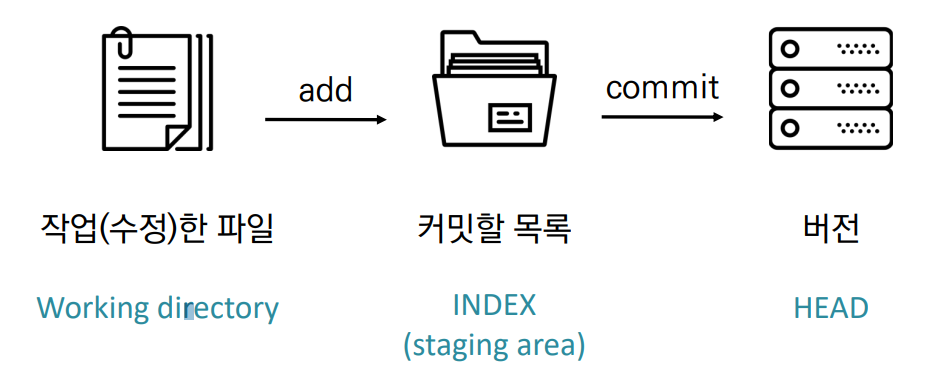
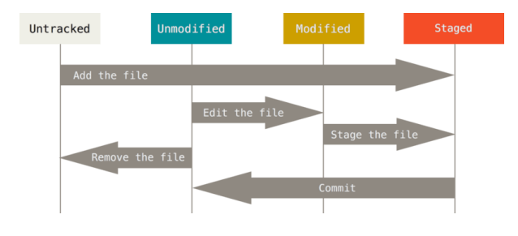

# Git

- 분산형상관리시스템
- Git branch
- 차이(`diff`)와 수정 이유를 메세지로 남길 수 있다
- 버전이 기록되어 있으면 이전 시점을 조회하거나 복원시킬 수 있다
- 변경사항을 추적

## 1. Flow

1. 작업 후
2. `add`하여 Staging area에 적재
3. `commit`으로 버전 기록
4. `modified` `staged` `committed`
   - modifed : 파일이 수정된 상태 (`add` -> staging area로 )
   - staged : 수정한 파일을 곧 커밋할 것이라고 표시한 상태 (`commit` -> 저장소)
   - committed : 커밋이 된 상태

## 2. 설정

### 사용자 정보(commit author)

## 3. 기본 명령어

### init

`$git init`

- 특정 폴더를 git 저장소(repository)를 만들어 git으로 관리 (`.git` 폴더가 생성됨)
- git bash에서 `(master)`라는 표기를 확인할 수 있다(windows)

### add

`$git add`

- working directory상의 변경 내용을 staging area에 추가
- untracked 상태 -> staged로 변경
- modified 상태 -> staged로 변경

### commit

`$git commit -m '메세지'`

- staged 상태의 파일들을 `commit`을 통해 버전으로 기록
- commit 메세지는 변경 사항을 나타낼 수 있도록 명확하게 작성

- 데이터를 파일 시스템의 스냅샷으로 관리, 크기가 작음
- g파일이 달라지지 않으면 새로 저장하지 않음

### status

`$git status`

- git 저장소에 있는 파일의 상태를 확인하기 위해 사용
- 파일의 상태를 확인할 수 있다

- `Tracked` : 이전부터 버전으로 관리되고 있는 파일

  - Unmodified : git status에 나타나지 않음

  - Modified : Changes not staged for commit

  - Staged : Changes to be committed

    

- `Untracked` : 버전으로 관리된 적 없는 파일(파일을 새로 만든 경우)

### log

`$git log`

- 현재 저장소에 기록된 커밋을 조회

- 다양한 옵션을 통해 로그를 조회할 수 있음

  - `$git log -1`
  - `$git log --oneline`
  - `$git log -2 --oneline`

  

