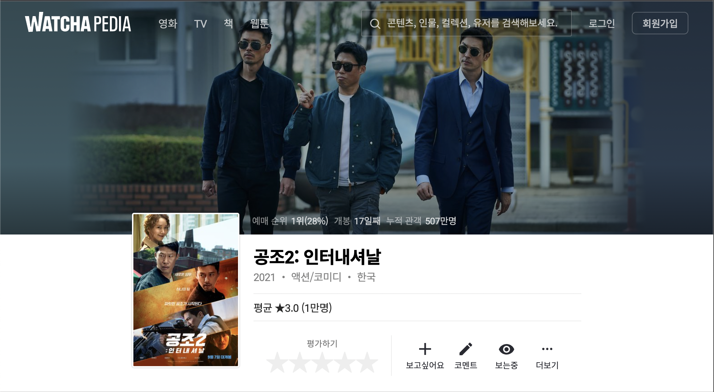
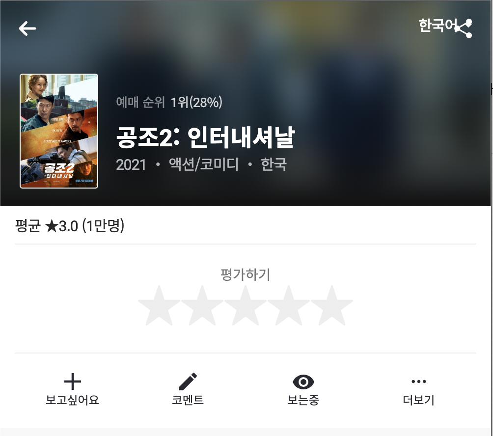
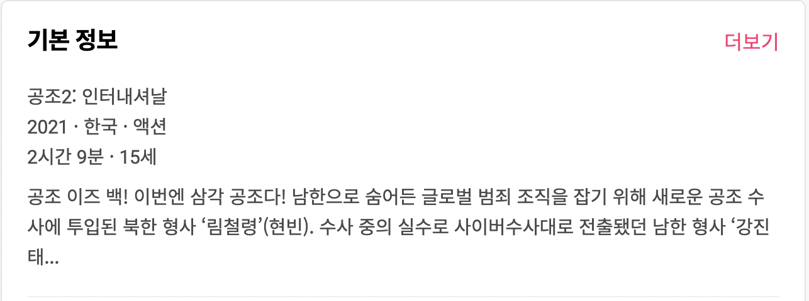
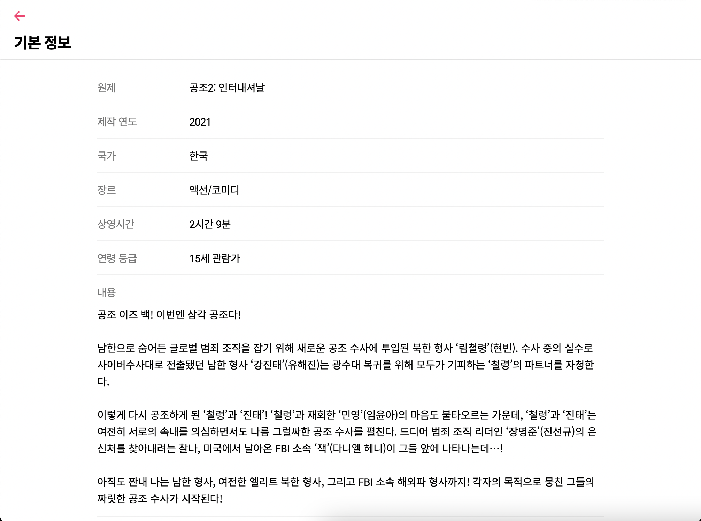
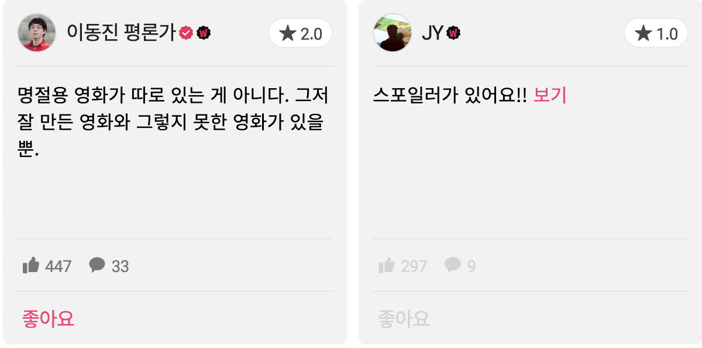

# 메인 페이지

## 상단

#### 내비게이션 바(좌측)

- 영화 프로그램
- TV 프로그램
- 책
- 웹툰

> 메인 페이지 출력만 바뀜 (비동기)

 

#### 내비게이션 바(센터)

- 검색
  - 인기 검색어(실시간 Top 5?)
  - 연관 검색어(입력 데이터에 따라 자동완성)

 

#### 내비게이션 바(우측)

- 로그인(모달 팝업)
- 회원가입(모달 팝업)

 

 

---

## 컨텐츠 영역

### 영화 프로그램

- 박스 오피스 순위
- 왓챠 Top 10
- 넷플릭스 영화 순위
- 왓챠 실시간 급상승 Top 30
- 평균별점 높은 작품
- 화제의 감독 (감독이름)의 작품
- 화제의 배우 (배우이름)의 작품
- #장르1 #장르2
- 인플루언서 컬렉션(해당 유저가 관심버튼 누른 영화들?)
- 인플루언서 컬렉션(해당 유저가 관심버튼 누른 영화들?)
- 인플루언서 컬렉션(해당 유저가 관심버튼 누른 영화들?)
- 왓챠피디아 컬렉션(수상작, 최고 인기작들로 구성)

 

### TV 프로그램

- 한국 TV 프로그램 인기 순
- 왓챠 Top 10 TV 프로그램
- 미국 TV 프로그램 인기 순위
- 넷플릭스 TV 프로그램 순위
- 왓챠 실시간 급상승 Top 30
- 평균별점 높은 작품
- 화제의 배우 (배우이름) 작품
- #장르1 #장르2
- 인플루언서 컬렉션(해당 유저가 관심버튼 누른 TV프로그램?)
- 왓챠피디아 컬렉션(수상작, IMDB 평점 순, 시청률 TOP)

 

### 신간 베스트셀러 순위

- 신간 베스트셀러 순위
- 검색 순위
- (평론가 이름) 평론가가 평가한 책
- 평균 별점이 높은 작품
- 화제의 작가 (작가 이름)의 작품
- #장르1 #장르2
- 인플루언서 컬렉션(해당 유저가 관심버튼 누른 책?)
- 왓챠피디아 컬렉션(읽어야할 도서 선정작, 수상작, 권장도서)

 

### 웹툰

- (플랫폼 이름) 인기 웹툰
- 최근 연재 작
- 정주행하기 좋은 완결 웹툰
- 평균별점 높은 작품
- #장르
- 왓챠피디아 컬렉션(수상작)

 

 

---

## 리뷰 영역

컨텐츠를 클릭하면 리뷰 페이지로 이동

- 영화 스틸 컷으로 배너

> 반응형 최소 width일 때

- 기본 정보

> 더보기 클릭시 오버뷰 페이지로 이동
>
> 

- 별점 그래프
- 코멘트

> 카드로 구성 (좋아요 내림차순 정렬)
>
> 누르면 코멘트의 좋아요, 댓글, 공유

- 갤러리
- 영상(티저, 예고편)
- 이 작품이 담긴 컬렉션
- 비슷한 작품

 

 

---

### 유저 페이지

- 이름
- 유저의 취향분석
- 평가수
- 별점 분포
- 영화 선호태그
- 선호배우
- 선호감독
- 영화 선호국가
- 영화 선호장르
- 영화 감상 시간
- 책 선호태그
- 선호작가

 

### 감독/작가 페이지

- 감독이름
- 작품

 

### 배우 페이지

- 배우이름
- TV 프로그램 출연작
- 영화 출연작