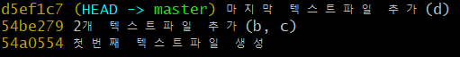

# 1. 로컬 저장소

## 실습1

### 1. 프로젝트 폴더 만들기

- 폴더 생성


### 2. 해당 폴더에서 git 버전 관리 시작

```bash
$ git init
```

- warning! `master`라고 되어 있으면 상위 폴더 확인
- 명령어를 입력하게 되면 `.git`폴더가 생성


### 3. 작업

- 빈 파일 생성
- `status`확인


### 4. 작업 완료 후 커밋

- 커밋 후, `log`확인


### 5. 수정, 삭제하면서 commit 3개 쌓기



- HEAD -> master : 로컬 저장소의 최종 커밋(버전) 이라는 내용


## 6. 추가

- 빈 폴더는 status에 나타지 않는다
- `test`폴더 생성 > `.gitkeep` 파일 생성


---

---

---


# 2. 원격 저장소

- 네트워크를 활용한 저장소
- `github` `gitlab` `bitbucket`


## github에서 원격 저장소 만들기

1. `New repository`
2. repository 이름 설정
3. 저장소 설명(option)
4. 공개 여부 설정
5. `create repository`


- 주소체계 : https://github.com/`username`/`저장소이름`.git

- 원격 저장소 정보를 로컬 저장소에 추가

  ```bash
  $ git remote add origin https://github.com/username/저장소이름.git
  ```

- `origin`은 단순히 이름이지만, `첫 remote`시 관례처럼 쓰임

  

### 원격저장소 정보 확인

```bash
$ git remote -v
```


## push

- 로컬 저장소의 버전(commit)을 원격 저장소로 보낸다

  ```bash
  $ git push <원격저장소이름> <브랜치이름>
  ```

- 원격 저장소로 로컬 저장소 변경 사항(commit)을 올림

- 로컬 폴더의 파일/폴더가 아닌 저장소의 버전(commit)이 업로드


## pull

- 원격 저장소의 버전(commit)을 로컬 저장소로 가져온다

  ```bash
  $ git pull
  ```
