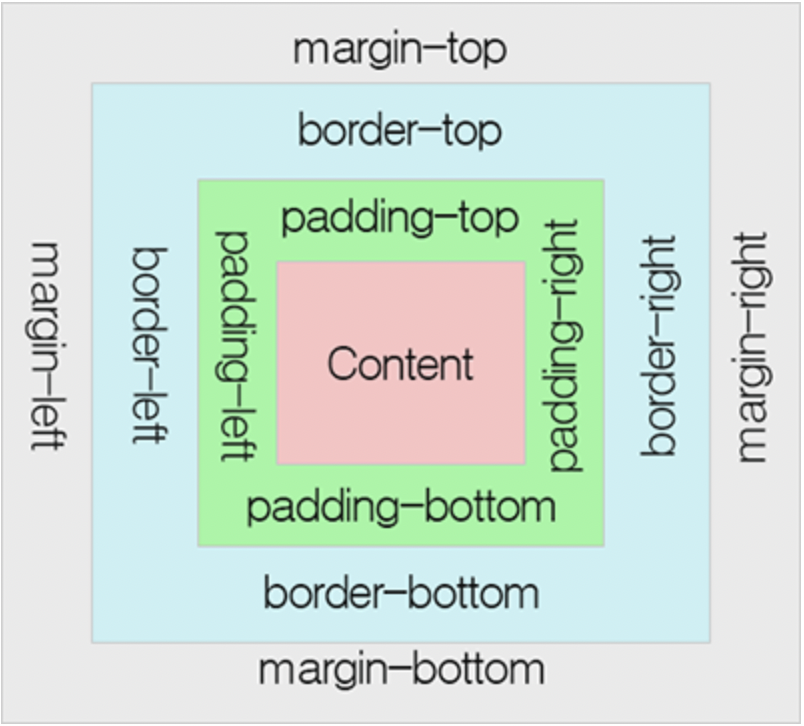

# <i>CSS</i>

### 1. 개념

- Cascading Style Sheet
- HTML 문서 내 요소들에 선택적으로 스타일을 적용
- 웹 페이지의 내용과 스타일을 분리, 스타일 요소를 정하는 규격

<br>

### 2. 구조

```css
p {
  color: blue;
  width: 500px;
  border: 1px solid black;
}

/* 
p, h1, li { color : green} 
여러 요소 선택 가능
*/
```

- 선택자`selector` : HTML 요소 이름, 꾸밀 요소를 선택 `p`
  - 요소 선택자 : `p`, `<p>`
  - 아이디 선택자 : `#my-id`, `<p id='my-id'>`
  - 클래스 선택자 : `.my-class`, `<p class='my-class'>`
  - 속성 선택자 : `img[src]`, ``
  - 수도 선택자 : `a:hover`
- 선언 : 요소 속성을 명시 `color : blue`
- 속성`property` : HTML 요소를 꾸밀 수 있는 방법 `color : `
- 속성 값 : 속성의 오른쪽, 콜론 뒤, `blue`

<br>

### 3. 사용법

- 어디에 기술하느냐의 차이가 존재

  - HTML 태그의 `style` 속성을 이용

    ```html
    <div style='color : blue'>this is blue text</div>
    ```

  - `<style>`태그를 통해 HTML 문서 내부에 기술(주로 `<head>`태그 내부에서 사용)

    ```html
    <html>
    <head>
    	<style type="text/css">
    		.my-text{ color: blue }
    	</style>
    </head>
    <body>
    	<div class="my-text">
    		this is red blue
    	</div>
    </body>
    </html>
    ```

  - `.css`파일로 분리해 HTML 문서에 연결

    ```html
    <head>
    	<link rel="stylesheet" href="경로.css" type="text/css">
    </head>
    ```

- 주석 : `/*`로 시작해 `*/`로 끝난다

<br>

#### 3-1 글꼴, 문자

```css
<link href='http://fonts.googleapis.com/css?family=Open+Sans' rel='stylesheet' type='text/css'>
```

```css
html {
  font-size: 10px;
  font-family: placeholder;
}
```

> html안의 모든 요소는 같은 font-size와 font-family를 물려 받는다.

<br>

#### 3-2 박스



>  이미지출처 : TCPschool

- `padding` : 컨텐츠 주위 공간(ex. 문단 글자의 주위)
- `border` : padding 바깥쪽에 놓인 실선
- `margin` : 요소 바깥 쪽을 둘러싼 공간

<br>

### 4. 적용 우선순위

- 한 태그에 속성이 중복되는 경우, 어떤 속성이 우선 적용되는지 명시

- 우선순위 : `ID` > `class` > `Tag`

  - `!important`

    - 우선순위 무시, 꼭 적용하고 싶은 속성이 있다면 속성 뒤에 붙인다

      ```css
      color : black !important
      ```

  - HTML에서 `style`을 직접 지정한 속성

  - `#id`로 지정한 속성

  - `.class`, `:class`로 지정한 속성

  - `태그이름`

  - 상위 객체에 의해 상속된 속성

<br>

### 5. 레퍼런스

- [ofcourse](https://ofcourse.kr/css-course/CSS-%EC%9E%85%EB%AC%B8)

- [MDN web docs](https://developer.mozilla.org/ko/docs/Learn/Getting_started_with_the_web/CSS_basics)
- [TCPschool](http://www.tcpschool.com/css/intro)