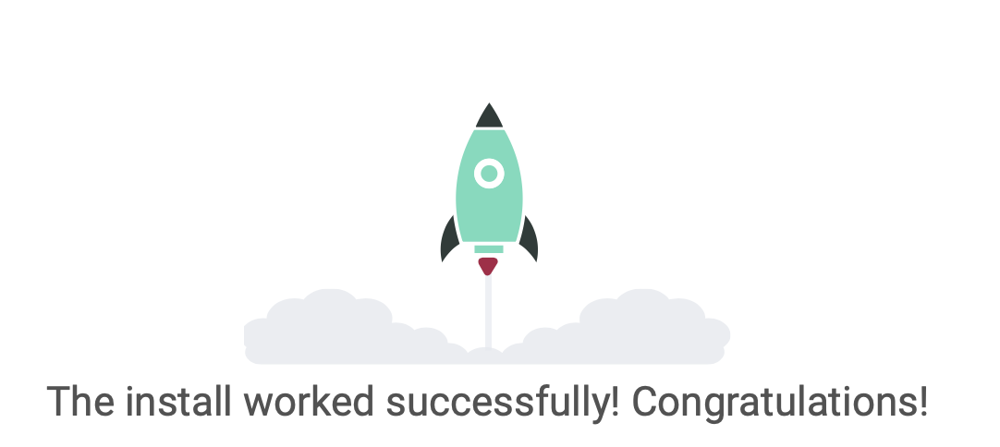

## Django

##### 프로젝트 생성

```bash
$ django-admin startproject firstproject .
```

> 프로젝트 이름으로 예약어 및 하이픈 사용 불가
>
> `.`을 붙이지 않을 경우 현재 디렉토리에 프로젝트 디렉토리를 새로 생성

<br>

##### 서버 실행

```bash
$ python manage.py runserver
```

<br>

#### 프로젝트 구조

`__init__.py`

- python에게 이 디렉토리를 하나의 python 패키지로 다루도록 지시
- 별도로 추가 코드를 작성하지 않음

`asgi.py`

- Asynchronous Server Gateway interface

- Django 어플리케이션이 비동기식 웹 서버와 연결 및 소통하는 것을 도움
- 배포 시 사용

`settings.py`

- Django 프로젝트 설정을 관리

`urls.py`

- 사이트 url과 적절한 views의 연결 지정
- 서비스의 입구와 같음

`wsgi.py`

- Web Server Gateway Interface
- Django 어플리케이션이 웹서버와 연결 및 소통하는 것을 도움
- 배포 시 사용

`manage.py`

- Django 프로젝트와 다양한 방법으로 상호작용 하는 커맨드라인 유틸리티

  ```bash
  $ python manage.py <command> [options]
  
  # 앱 생성
  $ python manage.py startapp articles
  ```


<br>

<br>

---

<br>

## guide

```bash
mkdir [projectname]
```

> Django 프로젝트 관리를 위한 폴더 생성

<br>

```bash
projectname> python3 -m venv [venvname]
```

> 프로젝트 폴더로 이동해 장고를 위한 가상환경 생성

```bash
projectname> cd venvname
venvname> ls
bin        include    lib        pyvenv.cfg
```

> bin, include, lib 와 같은 디렉토리와 pyvenv.cfg 라는 설정 파일이 생성

<br>

```bash
projectname> source venvname/bin/activate
```

```bash
projectname> . venvname/bin/activate
```

> 둘다 똑같은 코드
>
> 가상환경 활성화

<br>

```bash
(venvname) projectname> pip install django==3.2.13
```

> LTS버전 사용 권장

<br>

```bash
(venvname) projectname> django-admin startproject [web01] .
```

```bash
(venvname) projectname> cd web01
```

```bash
(venvname) web01> ls
manage.py     web01
```

> django 프레임워크 로드
>
> 마침표, 현재 폴더에 django 프레임워크를 로드

<br>

```bash
(venvname) web01> python manage.py startapp [appname]
```

```python
INSTALLED_APPS = [
  'appname',
]
```

> web01 폴더의 `settings.py`에서 앱 등록

<br>

```bash
(venvname) web01> python manage.py runserver
```



> 서버 실행 (확인), 서버 종료 `터미널에서 ctrl + c`

<br>


## DJANGO 개발 순서

1. `urls.py`

``` python
from appname import views

urlpatterns = [
  path('admin/', admin.site.urls),
  path('', views.index),
]
```

2. `views.py`

```python
def index(request):

  return render(request, "index.html")
```

> app 폴더에 `templates`폴더 생성 후 `index.html` 생성

<br>

## LTS (장기 지원 버전)

- Long Term Support
- 장기간에 걸쳐 지원하도록 고안된 소프트웨어 버전
- SW의 제품 수명주기 관리 정책
- 배포자는 LTS확정을 통해 장기적이고 안정적인 지원 보장