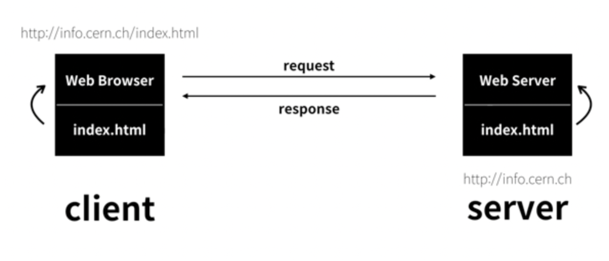

## Framework

누군가 만들어 놓은 코드를 재사용하는 것

이미 수없이 많이 개발된 코드 중 자주 사용되는 부분을 재사용할 수 있게 좋은 구조로 만들어져 있음

> 서비스 개발에 필요한 기능들을 미리 구현해서 모아놓은 것

 

## 클라이언트-서버

대부분의 웹서비스는 `클라이언트-서버`구조 기반으로 동작

> 클라이언트, 서버 역시 하나의 컴퓨터이다.

<right>이미지 출처 : 생활코딩</right>

 

#### 클라이 언트

- 웹 사용자의 인터넷에 연결된 장치
- 웹 브라우저
- 서비스를 요청하는 주체

 

#### 서버

- 웹 페이지, 사진, 앱을 저장하는 데이터
- 클라이언트가 접근하려고 할 때 서버에서 클라이언트로 응답
- 요청`request`에 대해 응답`response`하는 주체

 

 

## 웹 브라우저

`브라우저`란 웹에서 페이지를 찾아 보여주고, `하이퍼링크`를 통해 다른 페이지로 이동할 수 있도록하는 프로그램

웹 페이지 파일을 우리가 보는 화면으로 바꿔주는`렌더링, rendering` 프로그램

 

## 웹 페이지

#### 정적 웹 페이지`static`

  HTML 파일의 내용이 변하지 않고 모든 사용자에게 동일한 모습으로 전달되는 것

  있는 그대로를 제공

   

#### 동적 웹 페이지`dynamic`

  요청에 따라 웹 페이지에 추가적인 수정이 되어 클라이언트에게 전달되는 웹 페이지

  웹 페이지 내용을 바꿔주는 주체 : `서버`
