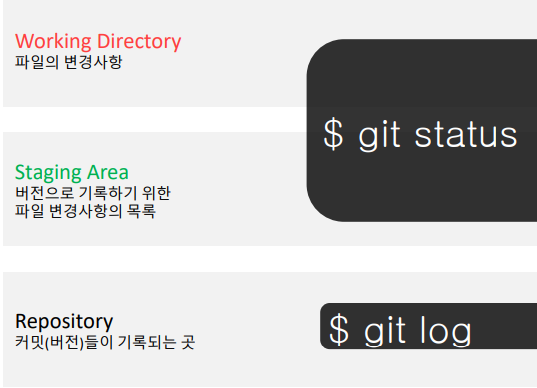

# Git

- 분산형상관리시스템
- Git branch
- 차이(`diff`)와 수정 이유를 메세지로 남길 수 있다
- 버전이 기록되어 있으면 이전 시점을 조회하거나 복원시킬 수 있다
- 변경사항을 추적


## 1. Flow

1. 작업 후
2. `add`하여 Staging area에 적재
3. `commit`으로 버전 기록
4. `modified` `staged` `committed`
   - modifed : 파일이 수정된 상태 (`add` -> staging area로 )
   - staged : 수정한 파일을 곧 커밋할 것이라고 표시한 상태 (`commit` -> 저장소)
   - committed : 커밋이 된 상태


## 2. 설정

### 사용자 정보(commit author)


## 3. 기본 명령어

### init

`$ git init`

- 특정 폴더를 git 저장소(repository)를 만들어 git으로 관리 (`.git` 폴더가 생성됨)
- git bash에서 `(master)`라는 표기를 확인할 수 있다(windows)


### add

`$ git add`

- working directory상의 변경 내용을 staging area에 추가
- untracked 상태 -> staged로 변경
- modified 상태 -> staged로 변경


### commit

`$ git commit -m '메세지'`

- staged 상태의 파일들을 `commit`을 통해 버전으로 기록
- commit 메세지는 변경 사항을 나타낼 수 있도록 명확하게 작성


- 데이터를 파일 시스템의 스냅샷으로 관리, 크기가 작음
- g파일이 달라지지 않으면 새로 저장하지 않음


### status

`$ git status`

- git 저장소에 있는 파일의 상태를 확인하기 위해 사용
- 파일의 상태를 확인할 수 있다


- `Tracked` : 이전부터 버전으로 관리되고 있는 파일

  - Unmodified : git status에 나타나지 않음

  - Modified : Changes not staged for commit

  - Staged : Changes to be committed

    

- `Untracked` : 버전으로 관리된 적 없는 파일(파일을 새로 만든 경우)


### log

`$ git log`

- 현재 저장소에 기록된 커밋을 조회

- 다양한 옵션을 통해 로그를 조회할 수 있음

  - `$ git log -1`
  - `$ git log --oneline`
  - `$ git log -2 --oneline`

  


### push

```bash
$ git push 원격저장소이름 브랜치이름

ex)
$ git push origin master
```

- 원격 저장소로 로컬 저장소 변경 사항을 `push`
- 로컬 폴더의 파일/폴더가 아닌 저장소의 버전이 올라감


### clone

```bash
$ git clone https://github.com/tensorflow/tensorflow.git
// tensorflow 원격 저장소로부터 복제해 가져옴
```

- 원격 저장소를 가져오는 방법은 `clone`과 `Download ZIP`2가지
- `clone`으로 가져올 경우 `.git폴더`가 있으며 최신버전외에도 조회가 가능
- `Download ZIP`으로 가져올 경우 최신버전의 프로그램만 조회가 가능
- 필요한 경우에 따라 `clone`과 `download ZIP`을 이용한다


#### clone과 pull의 차이점?

- `clone`과 `pull`은 원격 저장소로부터 커밋을 가져온다는 공통점이 있지만 `차이점`이 있다
- `clone`은 저장소 전체`폴더`를 복제
- `pull`은 저장소 내의 변경된 커밋`내용`을 받아온다


### branch

#### branch 시나리오

- branch 시나리오는 크게 3가지로 나뉜다 `fast-foward` `merge commit` `merge commit 충돌`


> **fast-foward**

feature branch 생성 후 master 브랜치에 변경사항이 없는 상황

1.  feature/home branch 생성 및 이동

   ```bash
   (master) $ git branch feature/home
   (master) $ git checkout feature/home
   
   또는
   
   (master) $ git checkout -b feature/home
   ```


2.  작업 후 commit

   ```bash
   (feature/home) $ touch a.txt
   (feature/home) $ git add .
   (feature/home) $ git commit -m 'ADD a.txt '
   (feature/home) $ git log --oneline
   ```

   

3. master로 이동

   ```bash
   (feature/home) $ git checkout master
   (master) $ git log --oneline
   ```

   

   

4.  master에 병합

   ```bash
   (master) $ git merge feaeture/home
   ```

   

5.  병합 후 branch 삭제

   ```bash
   (master) $ git branch -d feature/home
   ```
   
   - 자동삭제가 되지 않기 때문에 직접 삭제 필요


> **merge commit**

서로 다른 버전을 병합하는 과정에서 서로 다른 파일이 수정된 상황

1. feature/about branch 생성 및 이동

```bash
(master) $ git checkout -b feature/about
```


2. 작업 완료 후 commit

```bash
(feature/about) $ touch a.txt
(feature/about) $ git add .
(feature/about) $ git commit -m 'Add a.txt'
(feature/about) $ git log --oneline
21af6de (HEAD -> feature/about) 자기소개 페이지 완료!
2b31a64 (master) Complete Home!!!!
e29656a Init
```


3. master 이동

```bash
(feature/about) $ git checkout master
```


4. master에 추가 commit 발생

```bash
(master) $ touch master.txt
(master) $ git add .
(master) $ git commit -m 'Add master.txt'
(master) $ git log --oneline
98c5528 (HEAD -> master) 마스터 작업....
2b31a64 Complete Home!!!!
e89616a Init
```


5. master에 병합

```bash
(master) $ git merge feature/about
```


6. 자동으로 merge commit 발생

   

7. commit 확인

```bash
$ git log --oneline --graph
*   582902d (HEAD -> master) Merge branch 'feature/about'
|\
| * 5e1f6de (feature/about) 자기소개 페이지 완료!
* | 98c5528 마스터 작업....
|/
* b534a34 Complete Home!!!!
* e89616a Init
```


8. branch 삭제

```bash
$ git branch -d feature/about 
Deleted branch feature/about (was 5e1f6de).
```


> **merge commit** 충돌

+내용 작성중


---

각 branch에서 작업 후 병합하기 위해서 `merge` 명령어를 사용

만약 서로 다른 커밋에서 동일한 파일을 수정한 경우 충돌이 발생할 수 있다(직접 수정 필요)


Feature Branch Workflow

- Shared repository model (저장소의 소유권이 있는 경우)


Forking Workflow

- Fork & Pull model (저장소의 소유권이 없는 경우)


#### git/github 기본 브랜치 설정

- 과거부터 활용된 기술 용어 `master` `slave`
- github는 2020년부터 master에서 `main`으로 변경
- 과거 자료 및 구글링시 `master`로 표현된 경우가 많아 `master`로 변경
- `black-lives-matter`


#### git

```bash
$ git config --global init.defaultBranch master
```


#### github

- **`프로필 설정`** > `Repositories` > `Repository default branch` > `master`로 수정


```bash
$ git config --global --list
```


# 참고

### git 영어사전 
