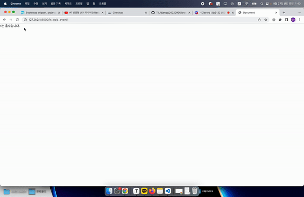

## Django 0926 실습



### 구현 내용

- URL 파라미터를 이용한 `홀수/짝수 구별`
- URL 파라미터를 이용한 `사칙연산`
- 이름을 입력받아 `랜덤 전생`
- 한글 `lorem 생성`

---

#### 사칙연산

- `django-mathfilters` 라이브러리 사용

  ```bash
  pip install django-mathfilters
  # 라이브러리 설치

- `settings.py`에 **mathfilters** 추가

  ```python
  INSTALLED_APPS = [
    .
    'mathfilters',
    .
  ]
  ```

  

> 사용법 a|[연산자]:b

---

#### 랜덤 전생

입력 페이지, 결과 페이지 2개로 구현

- 입력 페이지에서 `<form action="">`을 활용해 입력값을 넘김

---

#### 한글 lorem

이중 리스트를 만들어, 출력 템플릿에서 다시 개별 리스트로 풀어 출력`이중 for문`
