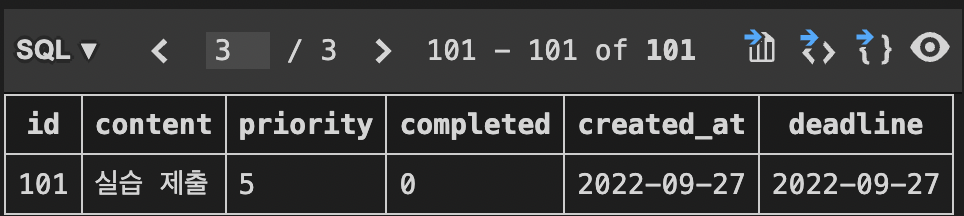
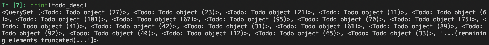
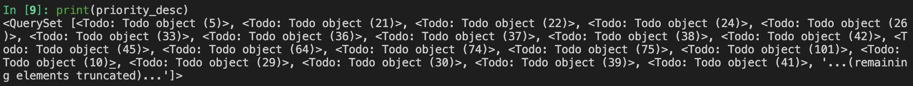
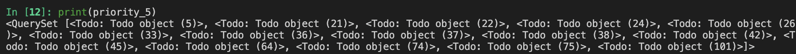
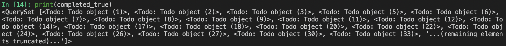

# 실습 안내

shell_plus 터미널에서 아래 실습 문제들을 해결합니다.
각 실습 문제를 해결하는 코드는 각 문제 코드 블럭에 작성합니다.
실습 완료 후 현재 파일 `실습.md` 을 실라버스에 제출합니다.

# 실습 문제

1. 아래 내용의 데이터 추가하기.
   - content : 실습 제출
   - priority : 5
   - deadline : 2022-09-27

```py
Todo.objects.create(content='실습 제출', priority='5', deadline='2022-09-27')
```



<br>

2. 모든 데이터를 id를 기준으로 오름차순으로 정렬해서 가져오기.

```py
todo_asc = Todo.objects.order_by('id')
```



<br>

3. 모든 데이터를 deadline을 기준으로 내림차순으로 정렬해서 가져오기.

```py
todo_desc = Todo.objects.order_by('-deadline')
```



<br>

4. 모든 데이터를 priority가 높은 순으로 정렬해서 가져오기.

```py
priority_desc = Todo.objects.order_by('-priority')
```



<br>

5. priority가 5인 모든 데이터를 id를 기준으로 오름차순으로 정렬해서 가져오기.

```py
priority_5 = Todo.objects.filter(priority=5).order_by('id')
```



<br>

6. completed가 True인 모든 데이터를 id를 기준으로 오름차순으로 정렬해서 가져오기.

```py
completed_true = Todo.objects.filter(completed=True).order_by('id')
```

<br>

7. priority가 5인 데이터의 개수

```py
priority_5 = Todo.objects.filter(priority=5)
print(len(priority_5))
```

```
15
```

<br>

8. id가 1인 데이터 1개 가져오기.

```py
Todo.objects.get(id=1)
```

9. id가 1인 데이터 삭제하기.

```py
id_is_1 = Todo.objects.get(id=1)
id_is_1.delete()
```

10. id가 10인 데이터의 priority 값을 5로 변경하기.

```py
id10 = Todo.objects.get(id=10)
id10.priority = 5

id10.save()

print(id10.priority)
```
